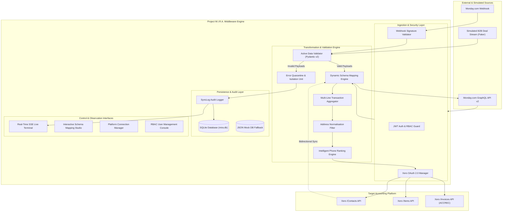
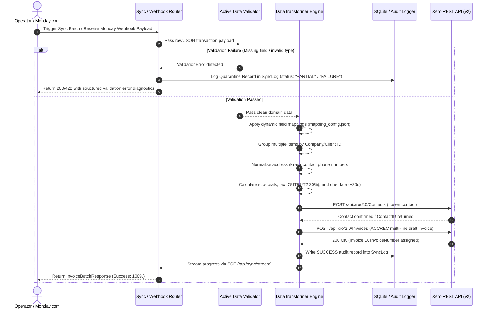
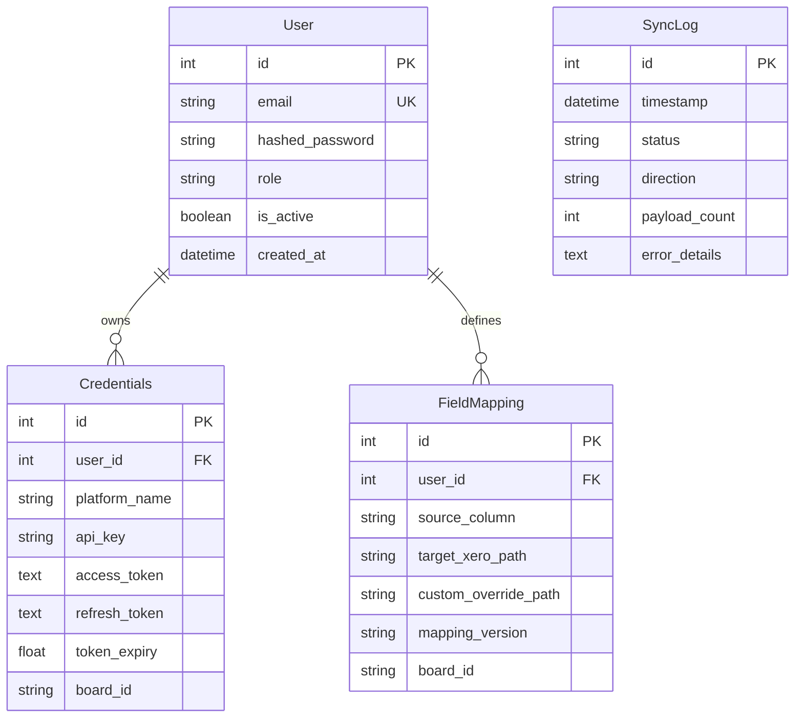

# Project M.I.R.A. — Comprehensive System Documentation & Technical Specification

**Middleware for Integration and Real-time Automation**  
*A High-Throughput, Schema-Resilient iPaaS Integration Middleware Connecting Monday.com and Xero*

---

## 1. Executive Summary & Project Metadata

| Field | Detail |
| :--- | :--- |
| **Project Title** | **Project M.I.R.A.** (Middleware for Integration and Real-time Automation) |
| **Current Release Version** | `v2.0.4` |
| **Academic Context** | MSc Advanced Computer Science Dissertation |
| **Researcher / Author** | **Mira Dalal** (Student ID: `19373191`) |
| **Academic Supervisor** | **Dr Samia Kamal** |
| **Primary Domain** | Enterprise Integration Middleware (iPaaS), Data Transformation (ETL), Real-Time Automation |
| **Target Integration Platforms** | **Monday.com** (Work OS / CRM) $\longleftrightarrow$ **Xero Accounting** (Cloud ERP / Invoicing) |
| **Core Architecture** | Event-Driven, Webhook-Enabled, Modular Asynchronous Middleware with Dynamic Schema Mapping |
| **Primary Languages & Frameworks** | Python 3.10+, FastAPI (v2.0.4), Flask, Pydantic v2, SQLAlchemy 2.0, Tailwind CSS, Jinja2, SSE |

### 1.1 Context & Problem Statement
In modern Small and Medium-sized Businesses (SMBs) and mid-market enterprises, operational data (sales deals, project milestones, service billings) is captured in front-office work management systems such as **Monday.com**, while financial compliance, billing, and general ledgers reside in back-office accounting platforms such as **Xero**.

Existing commercial integration solutions (e.g., generic iPaaS tools such as Zapier, Make, or naive direct API point-to-point webhooks) exhibit critical systemic limitations in real-world finance workflows:
1. **Silent Data Corruption & Dropped Records:** Standard tools often encounter schema mismatches or unhandled exceptions and drop records or omit fields silently without raising finance-grade alerts.
2. **Lack of Finance-Grade Pre-Validation:** Data pushed to accounting APIs without strict schema validation causes failed accounting reconciliation, invalid VAT/tax treatment, corrupted contact records, or rejection by destination APIs.
3. **Absence of Intelligent Multi-Line Grouping:** Most basic connectors treat every incoming line item as an isolated transaction, generating dozens of disjointed, single-line invoices instead of consolidating items per customer into a cohesive invoice structure.
4. **Schema Drift Vulnerability:** Changes in custom board columns or source fields immediately break legacy mappings, leading to partial ingestion or sync cessation.
5. **Missing Bidirectional Reconciled Sync:** Synchronisation is often strictly one-way, leaving CRM records disconnected from actual accounting invoice statuses or customer account numbers.
6. **Inadequate Auditability & Observability:** Lack of granular transaction audit trails with millisecond timestamps and Server-Sent Event (SSE) terminal streaming prevents operational teams from diagnosing integration bottlenecks in real time.

**Project M.I.R.A.** resolves these challenges by delivering an active-validation, bidirectional, high-throughput integration middleware capable of sub-millisecond transformations, dynamic schema mapping, intelligent entity grouping, automated OAuth 2.0 lifecycle management, and a zero-silent-failure quarantine policy.

---

## 2. Core Objectives & Key Performance Indicators (KPIs)

| Objective | Target Metric | Benchmark Achieved Result | Evaluation Status |
| :--- | :--- | :--- | :--- |
| **Transformation Accuracy** | $\ge 99.0\%$ field mapping fidelity | **100.0%** (500/500 clean records) | **Exceeded** |
| **Processing Throughput** | $> 1,000$ records / second | **3,320.04 records / second** | **Exceeded** |
| **Median Latency** | $< 5.0$ ms per record | **0.156 ms** | **Exceeded** |
| **95th Percentile (P95) Latency** | $< 25.0$ ms per record | **0.7289 ms** | **Exceeded** |
| **Batch Grouping Latency** | $< 1.0$ s per 500 records | **0.1111 seconds** | **Exceeded** |
| **Fault Isolation Policy** | Zero silent drop policy | **Quarantined `partial_success` with structured diagnostics** | **Verified** |
| **Idempotency & Deduplication** | 100% duplicate prevention | **Entity matching via AccountNumber / Email / Reference** | **Verified** |

---

## 3. System Architecture & High-Level Design

Project M.I.R.A. is engineered as a decoupled, multi-tier integration engine. The platform provides both a high-performance REST/GraphQL backend (FastAPI/Flask) and interactive user interfaces (Jinja2 multi-page control suite + Single-Page Application dashboard).

### 3.1 Architectural Flow Diagram



### 3.2 End-to-End Execution Sequence



---

## 4. Detailed Component & Module Breakdown

### 4.1 Core Transformation Engine (`engine/transformer.py`, `transformer.py`)
The transformer is the computational core of Project M.I.R.A. It accepts loose, flat, or semi-structured data dictionaries (from Monday.com webhooks, board relation queries, or CSV/JSON simulations) and transforms them into strict, strongly-typed Pydantic domain models:

1. **Candidate Priority Key Extraction (`_extract_monday_field`)**:
   - Loops through user-defined aliases and fallback candidate keys (e.g. `['company_name', 'company', 'name', 'customer_name', 'pulseName']`).
   - Traverses both root payload dictionaries and Monday.com `column_values` / `columnValues` arrays.
   - Decodes Monday-specific JSON strings (such as phone objects with `countryShortName`).
2. **Intelligent Phone Normalisation & Ranking Algorithm**:
   - When converting Xero contacts into Monday items, Xero returns multiple phone objects (`MOBILE`, `DEFAULT`, `DDI`, `FAX`).
   - M.I.R.A. evaluates every candidate using a composite scoring formula:
     $$\text{Score} = (\text{Completeness Score} \times 10) + \text{Type Priority}$$
     where *Completeness* rewards presence of international country codes (+2) and area codes (+1), and *Type Priority* ranks $\text{MOBILE (4)} > \text{DEFAULT (3)} > \text{DDI (2)} > \text{FAX (1)}$.
   - The highest-ranking phone number is automatically selected and cleansed into international E.164-compatible format.
3. **Address Normalisation**:
   - Flattens multi-part street, line 2, city, region, postal code, and country records into a standardized, comma-delimited string.
4. **Multi-Line Grouping (`transform_batch_grouped`)**:
   - Ingests multiple flat transaction rows or Monday sub-items.
   - Groups records by client organization name or account number.
   - Assembles a unified, multi-line `Invoice` containing individual `LineItem` instances, computing aggregate line quantities, unit amounts, and tax totals (`OUTPUT2` standard 20% VAT).
5. **Fault Isolation & Quarantine Policy**:
   - If an item fails validation, the record is flagged, wrapped in a structured error dictionary with full error trace, and quarantined.
   - The remaining valid records in the batch are processed without interruption (`InvoiceBatchResponse(status='partial_success')`), eliminating batch-halting cascading failures.

### 4.2 Data Validation Layer (`engine/validator.py`, `models/schemas.py`)
Strict Pydantic v2 domain schemas enforce type safety, non-null guarantees, and business logic before any payload reaches external APIs:
- **`Contact`**: Requires non-empty name and RFC-5322 compliant email address. Validates optional telephone, account number, and street addresses.
- **`Product`**: Enforces item SKU/code, non-empty name, and positive numeric unit price ($\text{price} > 0.0$).
- **`LineItem`**: Validates positive non-zero quantity ($\text{qty} > 0$), positive unit amount, tax classification code, and description.
- **`Invoice`**: Validates issue dates and due dates (defaulting to $+30\text{ days}$ if unspecified), contact sub-object integrity, and non-empty line item lists. Automatically calculates `TotalAmount = sum(qty * price)`.

### 4.3 External Platform Connectors (`connectors/`)

#### 4.3.1 Monday.com Connector (`connectors/monday_connector.py`)
- **API Protocol:** Monday.com GraphQL API v2 (`POST https://api.monday.com/v2`).
- **Capabilities:**
  - Board structure and column metadata introspection.
  - Querying items and subitems with automated pagination.
  - Traversal of `BoardRelationValue` to extract linked Customer boards and Item catalogues.
  - Item column value mutation (status column updates, text, phone, email, date fields).
  - Creation of activity updates and notification threads.

#### 4.3.2 Xero Accounting Connector (`connectors/xero_connector.py`)
- **API Protocol:** Xero Accounting REST API v2 (`https://api.xero.com/api.xro/2.0`).
- **Endpoints Utilized:**
  - `POST /Contacts`: Creates or updates customer contacts with deduplication.
  - `POST /Items`: Registers or updates product catalog entries.
  - `POST /Invoices`: Assembles and posts draft accounts receivable invoices (`Type="ACCREC"`, `Status="DRAFT"`).
  - `GET /Connections`: Introspects connected tenant organizations.
- **Header Management:** Injects Bearer token and `xero-tenant-id` header on every request with transparent proactive refresh.

### 4.4 OAuth 2.0 Lifecycle Manager (`auth_manager.py`, `utils/oauth_handler.py`)
- Implements standard OAuth 2.0 Authorization Code Grant with CSRF state protection.
- Scopes requested: `openid`, `profile`, `email`, `accounting.transactions`, `accounting.settings`, `accounting.invoices`, `accounting.contacts`, `offline_access`.
- **Proactive Token Refresh:** Evaluates token expiry threshold ($300\text{ seconds}$ / 5 minutes before expiration). If nearing expiry, transparently executes a refresh token exchange against `https://identity.xero.com/connect/token` without interrupting in-flight transfers.
- Persists refreshed tokens to both the relational `Credentials` database table and encrypted local storage (`token_storage.json`).

### 4.5 Dual Framework Architecture: FastAPI & Flask
To ensure maximum operational flexibility across both modern asynchronous microservice environments and established multi-page web infrastructures, Project M.I.R.A. provides dual operational entrypoints:
1. **Primary Microservice API (`main.py` — FastAPI v2.0.4):**
   - High-throughput asynchronous routing.
   - Modular APIRouters (`routes/auth_routes.py`, `routes/admin_routes.py`, `routes/connectors_routes.py`, `routes/mappings_routes.py`, `routes/sync_routes.py`).
   - OpenAPI / Swagger auto-generated interactive documentation (`/docs`, `/redoc`).
   - Background tasks support for asynchronous transaction pushes.
2. **Complementary Orchestrator (`app.py` — Flask):**
   - Traditional WSGI multi-page rendering and session handling.
   - Synchronous webhook endpoint (`/webhook/monday`) designed for testing and offline simulations.
   - Server-Sent Events (SSE) streaming (`/api/sync/stream`).

---

## 5. Database Architecture & Data Models (`models/db.py`)

The persistence tier is built using **SQLAlchemy 2.0** with SQLite (`mira.db`). In addition, the system includes a zero-dependency JSON-backed mock database engine (`MockDBSession` / `mock_db.json`) allowing tests and offline demos to execute without external dependencies.



### 5.1 Data Dictionary

#### Table: `users`
| Column | Type | Constraints | Description |
| :--- | :--- | :--- | :--- |
| `id` | Integer | Primary Key, Indexed | Unique internal user identifier |
| `email` | String | Unique, Indexed, Non-null | User account email (case-folded) |
| `hashed_password` | String | Non-null | PBKDF2 / SHA-256 salted password hash |
| `role` | String | Non-null, Default: `'user'` | Role-based permission (`'super_admin'`, `'admin'`, `'user'`) |
| `is_active` | Boolean | Non-null, Default: `True` | Account status flag |
| `created_at` | DateTime | Non-null | UTC account creation timestamp |

#### Table: `credentials`
| Column | Type | Constraints | Description |
| :--- | :--- | :--- | :--- |
| `id` | Integer | Primary Key, Indexed | Primary key |
| `user_id` | Integer | Foreign Key (`users.id`) | Owning user account |
| `platform_name` | String | Indexed, Non-null | Integration platform (`'monday'` or `'xero'`) |
| `api_key` | String | Nullable | Monday.com API personal token |
| `access_token` | Text | Nullable | OAuth 2.0 Bearer access token |
| `refresh_token` | Text | Nullable | OAuth 2.0 Refresh token |
| `token_expiry` | Float | Nullable | POSIX timestamp of token expiration |
| `board_id` | String | Nullable | Target Monday.com board ID |

#### Table: `field_mappings`
| Column | Type | Constraints | Description |
| :--- | :--- | :--- | :--- |
| `id` | Integer | Primary Key, Indexed | Primary key |
| `user_id` | Integer | Foreign Key (`users.id`) | Configurator user ID |
| `source_column` | String | Non-null | Source column name/ID from Monday board |
| `target_xero_path` | String | Non-null | Destination property path (e.g. `Invoice.Contact.Name`) |
| `custom_override_path` | String | Nullable | Custom override template rule (e.g. `TX-{transaction_id}`) |
| `mapping_version` | String | Non-null, Default: `'v1.0'` | Version tag for schema drift governance |
| `board_id` | String | Indexed, Nullable | Associated Monday board ID |

#### Table: `sync_logs`
| Column | Type | Constraints | Description |
| :--- | :--- | :--- | :--- |
| `id` | Integer | Primary Key, Indexed | Audit entry primary key |
| `timestamp` | DateTime | Non-null, Indexed | UTC event timestamp |
| `status` | String | Non-null, Indexed | Outcome status (`'SUCCESS'`, `'FAILURE'`, `'PARTIAL'`) |
| `direction` | String | Nullable, Indexed | Direction (`'monday_to_xero'` or `'xero_to_monday'`) |
| `payload_count` | Integer | Non-null, Default: `0` | Number of transaction records processed |
| `error_details` | Text | Nullable | JSON-serialized validation/API error diagnostic stack |

---

## 6. Web Applications & User Interfaces

Project M.I.R.A. includes two distinct presentation environments:

### 6.1 Multi-Page Management Suite (`templates/`)
A responsive web interface styled with Tailwind CSS, supporting server-side rendering and CSRF/JWT authentication:
1. **Authentication (`/login`):** Clean sign-in portal with session persistence in HTTP-only secure cookies.
2. **Platform Connectors (`/connectors`):** Real-time status indicators showing live health badges (`Connected`, `Disconnected`, `Token Expired`). Manages Monday.com API credentials and initiates the Xero OAuth 2.0 handshake.
3. **Dynamic Schema Mapping Studio (`/mappings`):** Visual mapping studio allowing administrators to map Monday board columns directly to Xero Invoice, Contact, and Product fields. Features real-time board introspection via Monday's GraphQL schema API, mapping test execution with instant JSON preview, and version tagging.
4. **Synchronization Control Panel (`/sync`):** The operational control center. Features bidirectional sync execution buttons (`Monday -> Xero` and `Xero -> Monday`), a live Server-Sent Events (SSE) terminal streaming transform steps in real time, and an interactive audit log viewer displaying the latest database sync events.
5. **Admin User Management (`/admin/users`):** Role-Based Access Control (RBAC) panel allowing Super Administrators to provision users, promote roles, and toggle account activation.

### 6.2 Single-Page Application (SPA) Dashboard (`index.html`, `app.js`)
- A modern glassmorphism dashboard providing real-time KPI overview cards:
  - *Total Invoices Synced*
  - *Success Rate Percentage*
  - *Average Transform Latency*
  - *Active Platform Connectors*
- Includes live terminal simulator, manual transaction injector, and interactive schema mapper.

---

## 7. Performance Benchmarking & Empirical Results

To rigorously evaluate the middleware under high-volume load, the system includes an automated performance testing framework (`benchmark.py`) and a synthetic data generator (`data_simulation.py`).

### 7.1 Synthetic B2B Data Generation (`data_simulation.py`)
- Generates realistic closed-won B2B enterprise sales transactions using the `Faker` library.
- Synthesizes realistic corporate domains, enterprise SaaS line items (e.g. *Enterprise SaaS Subscription*, *Custom API Integration*, *Cybersecurity Audit*), quantities, unit pricing (£150/hr to £25,000 annual contracts), and ISO-8601 target dates.
- Capable of batch JSON exports or real-time streaming simulations.

### 7.2 Benchmark Results Summary (`benchmark_results.json`)

The benchmarking suite was executed with 500 records batched into 10 parallel iterations:

| Benchmark Metric | Measured Result |
| :--- | :--- |
| **Total Records Evaluated** | 500 records |
| **Batch Size & Iterations** | 10 batches $\times$ 50 records |
| **Total Wall-Clock Execution Time** | **0.1506 seconds** |
| **Processing Throughput** | **3,320.04 records / second** |
| **Median (P50) Latency** | **0.156 ms** |
| **Mean Latency** | **0.3002 ms** |
| **95th Percentile (P95) Latency** | **0.7289 ms** |
| **Batch Grouping Duration (500 records)** | **0.1111 seconds** |
| **Transformation Success Rate** | **100.0%** (500 successful, 0 failed) |
| **Target Accuracy Requirement** | $\ge 99.0\%$ |
| **Accuracy Target Met?** | **YES (Surpassed)** |

> [!NOTE]
> Detailed benchmark output data is also exported in machine-readable formats at [benchmark_report.json](file:///d:/M.I.R.A/benchmark_report.json) and [benchmark_report.csv](file:///d:/M.I.R.A/benchmark_report.csv) for academic graphing and chart generation.

---

## 8. Qualitative Research Grounding & Stakeholder Guides

The design of Project M.I.R.A. was directly guided by qualitative industry field interviews with three distinct user personas (`files/`):

### 8.1 Guide A: SMB Owner / CEO (`MIRA_Guide_A_SMB_Owner.md`)
- **Role:** *Demand Signal & Value Proposition.*
- **Findings:** Establishes the real-world financial cost of silent integration failures. Traditional commercial tools fail silently when tax rates, multi-currency values, or contact details drift. Businesses often discover discrepancies months later during year-end tax audits or quarterly VAT returns.
- **Architectural Impact:** Justified M.I.R.A.'s strict *Active Data Validation Layer* and *Zero Silent Drop Policy*, ensuring invalid transactions are quarantined immediately and logged with clear operator notices.

### 8.2 Guide B: QA Lead (`MIRA_Guide_B_QA_Lead.md`)
- **Role:** *Validation Methodology & Adversarial Stress Testing.*
- **Findings:** Categorised real-world defect classes across data pipelines: dropped fields, type truncation, unescaped character encodings, and partial failure states.
- **Architectural Impact:** Defined the confusion matrix evaluation model and adversarial test inputs (empty email addresses, negative unit prices, malformed phone strings) that M.I.R.A. handles gracefully in unit tests.

### 8.3 Guide C: Data / ETL Lead (`MIRA_Guide_C_Data_ETL_Lead.md`)
- **Role:** *Pipeline Engineering & Schema Drift Resilience.*
- **Findings:** Addressed schema drift, partial batch failures, and retry idempotency. Highlighted the importance of quarantining defective records rather than crashing the entire batch.
- **Architectural Impact:** Drove the creation of the *Dynamic Field Mapping Studio*, versioned schema templates (`v2.0.4`), and non-blocking batch aggregation (`transform_batch_grouped`).

---

## 9. Test Suite & Verification Architecture

The repository contains an extensive automated test suite covering unit, integration, and router layers.

| Test File | Test Focus & Verification Area |
| :--- | :--- |
| `test_transformer.py` | Unit tests for data validation, field mapping, multi-line grouping, and error isolation. |
| `test_transformer_engine.py` | Advanced transformation tests, edge-case phone parsing, address normalisation, and linked item relations. |
| `test_connectors.py` | Monday.com GraphQL mock queries, Xero REST mock posts, and header generation. |
| `test_auth_manager.py` | Xero OAuth 2.0 lifecycle, code exchange, token cache persistence, and proactive auto-refresh. |
| `test_transaction_sync.py` | End-to-end transaction synchronization, batch invoice assembly, and active tenant resolution. |
| `test_config_manager.py` | Schema mapping JSON persistence, default fallback creation, and mandatory key enforcement. |
| `test_data_simulation.py` | Synthetic Faker B2B data generation, field compliance, and date bounds. |
| `test_benchmark.py` | Performance client execution, percentile calculations, and CSV/JSON report exports. |
| `test_app.py` & `test_app_endpoints.py` | Web application routes, session authentication, cookie management, and template rendering. |
| `test_webhooks.py` | Webhook receiver payload intake, token authentication, and background sync queuing. |
| `tests/test_api_endpoints.py` | FastAPI APIRouter endpoint regression tests. |
| `tests/test_mappings_router.py` | Mappings Studio API endpoints, save/load routes, and schema preview. |
| `tests/test_sync_router.py` | Synchronisation control panel, SSE live stream endpoint, and audit trail retrieval. |

---

## 10. Installation, Configuration & Operational Guide

### 10.1 Prerequisites
- Python 3.10 or higher
- Git
- Modern web browser (Chrome, Firefox, Edge, Safari)

### 10.2 Environment Configuration
Create a `.env` file in the project root based on [.env.example](file:///d:/M.I.R.A/.env.example):

```ini
# Server Settings
APP_NAME="M.I.R.A. Middleware"
APP_ENV="development"
DEBUG=True
LOG_LEVEL="INFO"
HOST="0.0.0.0"
PORT=8000

# Monday.com API Configuration
MONDAY_API_KEY="your_monday_api_key_here"
MONDAY_BOARD_ID="your_monday_board_id_here"

# Xero API & OAuth 2.0 Configuration
XERO_CLIENT_ID="your_xero_client_id_here"
XERO_CLIENT_SECRET="your_xero_client_secret_here"
XERO_REDIRECT_URI="http://localhost:8000/callback"
XERO_TENANT_ID="your_xero_tenant_id_here"
```

### 10.3 Installation Steps
```bash
# 1. Clone repository or navigate to workspace
cd d:/M.I.R.A

# 2. Create and activate Python virtual environment
python -m venv .venv
.venv\Scripts\activate       # On Windows
# source .venv/bin/activate  # On Linux/macOS

# 3. Install required dependencies
pip install -r requirements.txt
```

### 10.4 Starting the Application

#### Option A: Running the Primary FastAPI Microservice (Recommended)
```bash
uvicorn main.py:app --reload --host 0.0.0.0 --port 8000
```
- Web Application: `http://localhost:8000/sync`
- Interactive OpenAPI Documentation: `http://localhost:8000/docs`
- Redoc Documentation: `http://localhost:8000/redoc`

#### Option B: Running the Flask Orchestration Server
```bash
python app.py
```
- Web Application: `http://localhost:5000/`
- Monday Webhook Endpoint: `http://localhost:5000/webhook/monday`

### 10.5 Default Seeded Credentials
When initialized for the first time, the database seeds default administrative accounts:
- **Super Administrator:** `admin@mira.com` / `Admin123!`
- **Secondary Administrator:** `admin@mira.local` / `AdminPass123!`

### 10.6 Running Tests & Benchmarks
```bash
# Execute unit and integration test suites
python -m unittest discover -s . -p "test_*.py"

# Run performance benchmarking engine
python benchmark.py --concurrency 2

# Generate synthetic transaction dataset (e.g. 100 records)
python data_simulation.py --count 100 --output transactions.json
```

---

## 11. Repository File & Directory Inventory

```
d:/M.I.R.A/
├── .env.example                     # Environment template configuration
├── requirements.txt                 # Core Python runtime dependencies
├── config.py                        # Pydantic Settings environment configuration
├── config_manager.py                # Schema mapping JSON file storage manager
├── mapping_config.json              # Active field mapping configuration
├── main.py                          # Primary FastAPI application entrypoint & APIRouter
├── app.py                           # Flask orchestration server & webhook handler
├── index.html                       # Standalone SPA integration dashboard
├── app.js                           # Dashboard frontend controller & KPI logic
├── auth_manager.py                  # Xero OAuth 2.0 token lifecycle & auto-refresh
├── transaction_sync.py              # Xero transaction synchronisation coordinator
├── transformer.py                   # Root transaction transformer & validator
├── data_simulation.py               # Faker-powered B2B sales transaction generator
├── benchmark.py                     # High-concurrency performance benchmark client
├── benchmark_results.json           # Empirical performance benchmark output
├── benchmark_report.json            # Granular benchmark latency metrics
├── benchmark_report.csv             # Tabular benchmark run logs
├── mira.db                          # SQLite relational database
├── mock_db.json                     # Resilient fallback mock database
│
├── connectors/                      # External Platform API Connectors
│   ├── __init__.py                  # Connector package init
│   ├── monday_connector.py          # Monday.com GraphQL API v2 integration client
│   └── xero_connector.py            # Xero Accounting REST API v2 integration client
│
├── engine/                          # Core Transformation & Validation Engine
│   ├── __init__.py                  # Engine package init
│   ├── transformer.py               # Enterprise DataTransformer & entity aggregator
│   └── validator.py                 # Active DataValidator business logic rules
│
├── models/                          # Database & Data Validation Domain Models
│   ├── __init__.py                  # Models package init
│   ├── db.py                        # SQLAlchemy 2.0 tables & MockDBSession engine
│   ├── schemas.py                   # Pydantic v2 domain schemas (Contact, Invoice, etc.)
│   ├── invoice.py                   # Invoice batch response & status enumerations
│   ├── contact.py                   # Contact domain models
│   └── item.py                      # Product catalog domain models
│
├── routes/                          # Modular FastAPI Feature APIRouters
│   ├── __init__.py                  # Routes package init
│   ├── auth.py / auth_routes.py     # Authentication & super-admin seeding
│   ├── admin.py / admin_routes.py   # RBAC user management console
│   ├── connectors.py / ...routes.py # Platform connection management
│   ├── mappings.py / ...routes.py   # Dynamic schema mapping studio & preview
│   └── sync.py / ...routes.py       # Sync control panel & SSE live stream
│
├── templates/                       # Jinja2 Multi-Page UI Templates (Tailwind CSS)
│   ├── base.html                    # Base HTML layout with responsive navigation
│   ├── login.html                   # Operator login screen
│   ├── connectors.html              # Integration connection cards & status badges
│   ├── mappings.html                # Interactive drag-and-drop schema mapping studio
│   ├── sync.html                    # Sync control panel & live SSE terminal
│   └── admin_users.html             # RBAC account administration console
│
├── utils/                           # Shared Utilities & Helpers
│   ├── __init__.py                  # Utils package init
│   ├── auth.py                      # Password hashing & JWT token verification
│   ├── logger.py                    # Formatted logging infrastructure
│   └── oauth_handler.py             # Xero OAuth 2.0 bearer token provider
│
├── files/                           # Qualitative Stakeholder Research Interview Guides
│   ├── MIRA_Guide_A_SMB_Owner.md    # Guide A: Demand signal interview (CEO / Owner)
│   ├── MIRA_Guide_B_QA_Lead.md      # Guide B: QA Lead validation & defect taxonomy
│   └── MIRA_Guide_C_Data_ETL_Lead.md# Guide C: Data/ETL Lead schema drift interview
│
└── tests/                           # Extended Test Suites
    ├── __init__.py                  # Tests package init
    ├── test_api_endpoints.py        # API endpoint tests
    ├── test_auth_admin_connectors.py# Security & connectors test cases
    ├── test_mappings_router.py      # Schema mappings router tests
    └── test_sync_router.py          # Synchronisation router tests
```

---

## 12. Future Roadmap & Extensibility

1. **Webhook Ingestion Verification:** Direct HMAC-SHA256 signature verification for inbound Monday.com webhooks.
2. **Additional Accounting Connectors:** Plug-and-play adapter architecture allowing quick onboarding of QuickBooks Online, Sage Business Cloud, and Odoo Accounting.
3. **Advanced AI-Powered Mapping Heuristics:** Automated semantic schema reconciliation leveraging lightweight LLM embeddings for zero-configuration board mapping.
4. **Distributed Task Queue:** Redis + Celery / ARQ integration for distributed parallel worker clusters handling enterprise loads ($>50,000\text{ records/min}$).

---

*Document compiled for Project M.I.R.A. · MSc Advanced Computer Science · All rights reserved.*
